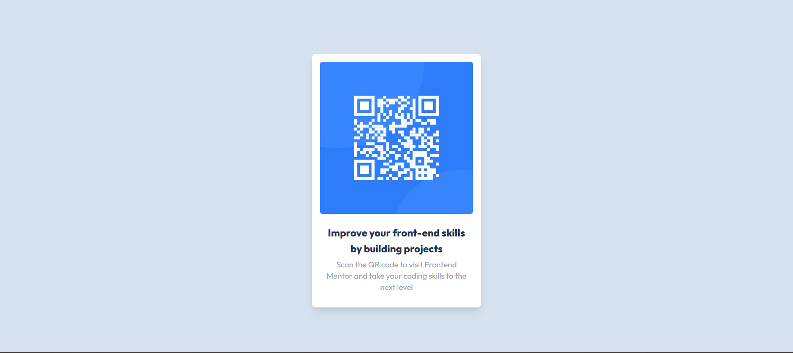
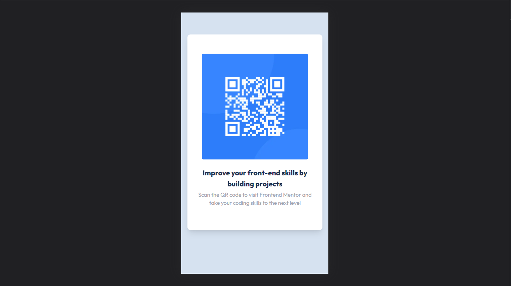

# Frontend Mentor - QR code component solution

This is a solution to the [QR code component challenge on Frontend Mentor](https://www.frontendmentor.io/challenges/qr-code-component-iux_sIO_H). Frontend Mentor challenges help you improve your coding skills by building realistic projects.

## Table of contents

- [Overview](#overview)
  - [Screenshot](#screenshot)
  - [Links](#links)
- [My process](#my-process)
  - [Built with](#built-with)
  - [What I learned](#what-i-learned)
  - [Continued development](#continued-development)
  - [Useful resources](#useful-resources)
- [Author](#author)
- [Acknowledgments](#acknowledgments)

**Note: Delete this note and update the table of contents based on what sections you keep.**

## Overview

### Screenshot

This is the Desktop View

This is the Desktop View

### Links

- Solution URL: [Add solution URL here](https://github.com/myk-francis/qr-code-component-next)
- Live Site URL: [Add live site URL here](https://qr-code-component-next.vercel.app/)

## My process

### Built with

- Flexbox
- Mobile-first workflow
- [React](https://reactjs.org/) - JS library
- [Next.js](https://nextjs.org/) - React framework

### What I learned

I learned alot from this one challange especially how difficult to and easy it is to style for both mobile and desktop view with Tailwind

## Author

- Website - [Mike Francis](https://myk-francis.github.io/michael-portfolio/)
- Frontend Mentor - [@myk-francis](https://www.frontendmentor.io/profile/myk-francis)
- Twitter - [@yourusername](https://www.twitter.com/Myk_Francis)

## Acknowledgments

This challenge has been an eye opener that I need to practice my design skills more. Will definetly look forward to doing more challenges
